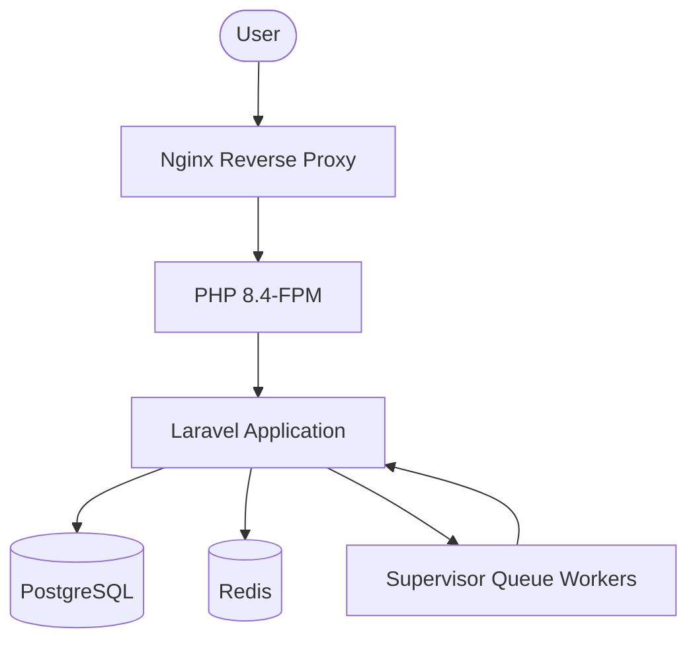

# POS Infrastructure Architecture

Comprehensive overview of the Emani Laundry POS system's server and software stack.

## System Overview

## Server Specifications

| Component    | Specification    |
| :----------- | :--------------- |
| **Provider** | VPS              |
| **OS**       | Ubuntu 22.04 LTS |
| **CPU**      | 6 Cores          |
| **RAM**      | 11GB             |

## Software Stack

| Service             | Version    | Purpose                                    |
| :------------------ | :--------- | :----------------------------------------- |
| **Web Server**      | Nginx      | Reverse proxy and static file serving      |
| **Language**        | PHP 8.4    | Main application logic                     |
| **Database**        | PostgreSQL | Persistent data storage                    |
| **Caching**         | Redis      | Session and cache storage                  |
| **Process Manager** | Supervisor | Managing Laravel queue workers             |
| **Node.js**         | Node 24    | Frontend builds and tooling                |
| **Package Manager** | PNPM       | Fast, disk-efficient dependency management |

## Directory Structure

- **Production**: `/var/www/production/pos`
- **Staging**: `/var/www/staging/pos`

## Database Access

- **Production DB**: `pos_prod` (User: `pos_prod_user`)
- **Staging DB**: `pos_staging` (User: `pos_staging_user`)
